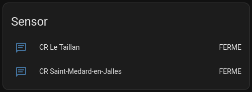

# Home Assistant Integration - Bordeaux Métropole - Déchetterie


## Configuration




```yaml
sensor:
  - platform: bdx_dechetterie
    bdx_no_data: "5"
  - platform: bdx_dechetterie
    bdx_no_data: "7"
```


gid | nom
 --- | ---
1 | CR Blanquefort
2 | CR Merignac
3 | CR Bassens EXT
4 | CR Eysines
5 | CR Le Taillan
6 | CR Bordeaux Bastide
7 | CR Saint-Medard-en-Jalles
8 | CR Surcouf
9 | CR Ambes
10 | CR Pessac
11 | CR Ambares et Lagrave
12 | CR Gutenberg
13 | CR Bruges
14 | CR Gradignan
15 | CR Villenave d'Ornon
16 | CR Bassens
17 | Déchetterie Carle Vernet


[source OpenData Bordeaux Métropole](https://opendata.bordeaux-metropole.fr/explore/dataset/dechetteries-en-temps-reel/table/)